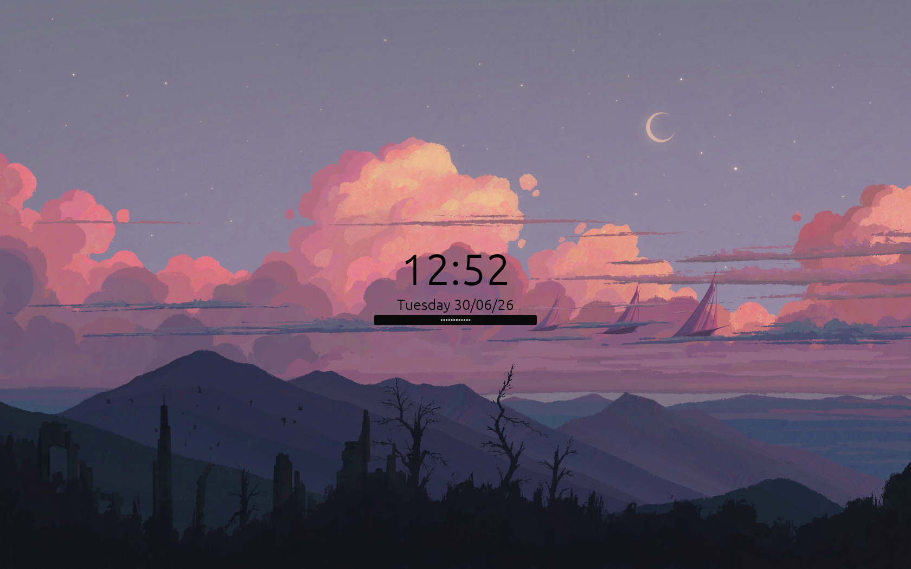

# Lockrs


Lockrs is a library that allows egui to render to a lock screen through the `ext-session-lock-v1` protocol. It also allows for different output on different monitors.

## Why?
Lockrs aims to be a scaffold for screen lockers, NOT a screen locker in of itself. You may also need to get into the fields of the library's types, if you need to do fancy stuff. 
So, the whole reason for this project's existence isn't to provide a ready-to-use lockscreen, but to be a way to make the most customizable lockscreen possible without going to down to protocol primitives.

## How?

To use the library, you first need to initialize the `App` struct through the `init` method. This will connect to the compositor, handle the surfaces, initialize `wgpu` and `egui` and handle the low-level stuff, in general. Once you init the `App` struct, you can use the `ui` method to talk to `egui`.

## Example
This is my personal lock screen:
```rs
let mut app = App::init();

let mut password = String::new();

app.ui(|output_name, ui| {
    egui::CentralPanel::default()
        .frame(egui::Frame::NONE)
        .show_inside(ui, |ui| {
            Image::new(include_image!("../wallhaven-sails.jpg"))
                .paint_at(ui, ui.ctx().content_rect());

            egui_alignments::center_vertical(ui, |ui| {
                ui.vertical_centered(|ui| {
                    ui.add(
                        Clock::new()
                            .time_style(|t| t.size(81.0).color(Color32::BLACK))
                            .date_style(|t| t.size(27.0).color(Color32::BLACK)),
                    );

                    ui.add(
                        egui::TextEdit::singleline(&mut password)
                            .desired_width(300.0)
                            .hint_text("Password...")
                            .horizontal_align(egui::Align::Center)
                            .password(true),
                    );

                    if ui.input(|input| input.key_pressed(egui::Key::Escape)) {
                        TryExit::Force
                    } else if ui.input(|input| input.key_pressed(egui::Key::Enter)) {
                        TryExit::PasswdCheck(password.clone())
                    } else {
                        TryExit::None
                    }
                })
            })
        })
        .inner
        .inner
        .inner
});
```

this code will produce the following output:


### Updates
This library may be updated in the future, so if it does happen, the API will probably change a bit.

#### License
<small>
Licensed under either of MIT or Apache License, Version 2.0 license at your option.
Unless you explicitly state otherwise, any contribution intentionally submitted for inclusion in this crate by you, as defined in the Apache-2.0 license, shall be dual licensed as above, without any additional terms or conditions. 
</small>